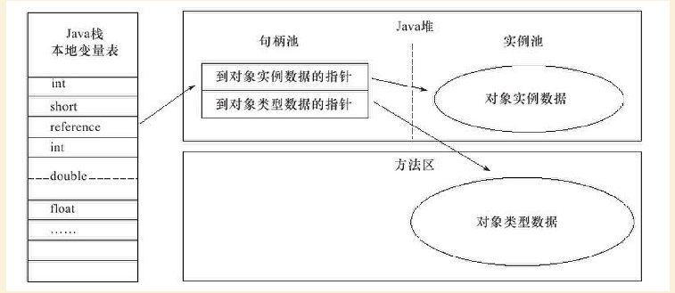
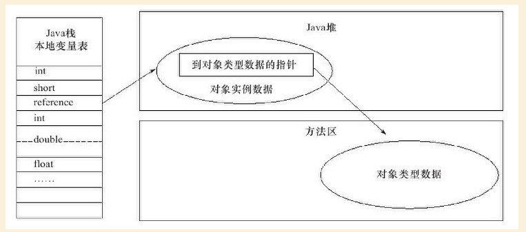

# JVM虚拟机原理

## Java内存区域与内存溢出异常

### 程序计数器

程序计数器是一块较小的空间，它可以看作是当前线程所执行的字节码行号指示器。在虚拟机的概念模型里，字节码解释器工作时就是通过改变这个计数器的值来选取下一条需要执行的字节码指令，分支、循环、跳转、异常处理、线程恢复等基础功能都需要依赖这个计数器来完成。

由于Java虚拟机的多线程是通过线程轮流切换并分配处理器执行时间的方式来实现的，在任何一个确定的时刻，一个处理器（对于多核处理器来说是一个内核）都只会执行一条线程中的指令。因此，为了线程切换后能恢复到正确的执行位置，每条线程都需要有一个独立的程序计数器，各条线程之间计数器互不影响，独立存储，我们称这类内存区域为“线程私有”的内存。 

如果线程正在执行的是一个Java方法，这个计数器记录的是正在执行的虚拟机字节码指令的地址；如果正在执行的是Native方法，这个计数器值则为空（Undefined）。此内存区域是唯一一个在Java虚拟机规范中没有规定任何OutOfMemoryError情况的区域。 

### Java虚拟机栈

Java虚拟机栈也是线程私有的，Stacks）也是线程私有的，它的生命周期与线程相同。虚拟机栈描述的是Java方法执行的内存模型：每个方法在执行的同时都会创建一个栈帧用于存储局部变量表、操作数栈、动态链接、方法出口等信息。每一个方法从调用直至执行完成的过程，就对应着一个栈帧在虚拟机栈中入栈到出栈的过程。

### 本地方法栈

本地方法栈与虚拟机栈所发挥的作用是十分相似的，他们之间的区别不过是虚拟机栈未虚拟机执行Java方法服务，而本地方法栈则为虚拟机使用到的Native方法服务。

### Java堆

对于大多数应用来说，Java堆是Java虚拟机所管理的内存中最大的一块。Java堆是被所有线程共享的一块内存区域，在虚拟机启动时创建。此内存区域的唯一目的就是存放对象实例，几乎所有的随想实例都是在这里分配内存。

根据Java虚拟机规范的规定，Java堆可以处于物理上不连续的内存空间中，只要逻辑上是连续的即可，就像我们的磁盘空间一样。在实现时，既可以实现成固定大小的，也可以是可扩展的，不过当前主流的虚拟机都是按照可扩展来实现的（通过-Xmx和-Xms控制）。如果在堆中没有内存完成实例分配，并且堆也无法再扩展时，将会抛出OutOfMemoryError异常。

### 方法区

方法区与Java堆一样，是各个线程共享的内存区域，它用于存储已被虚拟机加载的类信息、常量、静态变量、即时编译器编译后的代码等数据。Area）与Java堆一样，是各个线程共享的内存区域，它用于存储已被虚拟机加载的类信息、常量、静态变量、即时编译器编译后的代码等数据。虽然Java虚拟机规范把方法区描述为堆的一个逻辑部分，但是它却有一个别名叫做Non-Heap（非堆），目的应该是与Java堆区分开来。

Java虚拟机规范对方法区的限制非常宽松，除了和Java堆一样不需要连续的内存和可以选择固定大小或者可扩展外，还可以选择不实现垃圾收集。相对而言，垃圾收集行为在这个区域是比较少出现的，但并非数据进入了方法区就如永久代的名字一样“永久”存在了。这区域的内存回收目标主要是针对常量池的回收和对类型的卸载，一般来说，这个区域的回收“成绩”比较难以令人满意，尤其是类型的卸载，条件相当苛刻，但是这部分区域的回收确实是必要的。在Sun公司的BUG列表中，曾出现过的若干个严重的BUG就是由于低版本的HotSpot虚拟机对此区域未完全回收而导致内存泄漏。 根据Java虚拟机规范的规定，当方法区无法满足内存分配需求时，将抛出OutOfMemoryError异常。

### 运行时常量池

运行时常量池（Runtime Constant Pool）是方法区的一部分。Class文件中除了有类的版本、字段、方法、接口等描述信息外，还有一项信息是常量池（Constant Pool Table），用于存放编译期生成的各种字面量和符号引用，这部分内容将在类加载后进入方法区的运行时常量池中存放。

## 创建的对象分配算法

对象所需的内存大小在类加载完成后便可确定，为对象分配空间的任务等同于把一块确定大小的内存从Java堆中划分出来。假设Java堆中内存是绝对规整的,所有用过的内存都放在一边,空闲的内存放在另一边，中间放着一个指针作为分界点的指示器,那所分配内存就仅仅是把那个指针向空闲空间那边挪动一段与对象大小相等的距离。这种分配方式成为**指针碰撞**。
如果Java堆中的内存并不规整，已使用的内存和空闲的内存相互交错，那就没有办法简单地进行指针碰撞了，虚拟机就必须维护一个列表，记录上哪些内存块是可用的，在分配的时候从列表中找到一块足够大的空间划分给对象实例，并更新列表上的记录，这种分配方式为**空闲列表**。
选择那种分配方式由Java堆是否规整决定，而Java堆是否规整又由所采用的垃圾收集器是否带有压缩整理功能决定。因此，在使用Serial、ParNew等带Compact过程的收集器时，系统采用的分配算法是指针碰撞，而使用CMS这种基于Mark-Sweep算法的收集器是，通常采用空闲列表。

## 对象的内存布局

再HotSpot虚拟机中，对象在内存中存储的布局可以分为3块区域：对象头（Header）、实例数据（Instance Data)和对齐填充（Padding）。

### 对象头（Header）

HotSpot虚拟机的对象头包括两部分信息，第一部分用于存储对象自身的运行时数据，如哈希码、GC分代年龄、锁状态标志、线程持有的锁、偏向线程ID、偏向时间戳等，这部分数据的长度在32位和64位的虚拟机中分别未32bit和64bit，官方称为Mark Word。Mark Word是一个非固定的数据结构，会根据对象的状态复用自己的存储空间。例如在HotSpot虚拟机中，如果对象处于未被锁定的状态下，那么Mark Word中32bit中的25bit用于存储对象哈希码，4bit用于存储对象分代年龄，2bit用于存储锁标志位，1bit固定为0，以便在极小的空间内存储尽量多的信息。
另一部分是类型指针，即对象指向它的类元数据的指针，虚拟机通过这个指针来确定这个对象是哪个类的实例。如果对象是一个Java数组，那么在对象头中还必须有一块用于记录数组长度的数据，因为虚拟机可以通过普通Java对象的元数据确定对象大小，但是从数组的元数据中却无法确定。

### 实例数据（Instance Data）

实例数据部分是对象真正存储的有效信息，也是在程序代码中所定义的各种类型的字段内容，包括父类继承下来的。

### 对象填充

对象填充并不是必然存在的，也没有特别的含义，它仅仅起着占位符的作用。由于HotSpot VM的自动内存管理系统要求对象起始地址必须是8字节的整数倍，就是说对象的大小必须是8字节的整数倍。而对象头部分正好是8字节的倍数（一倍或者两倍），因此，当对象实例数据部分没有对齐是，就需要通过对齐补充来补全。

### 对象的访问定位

Java程序需要通过栈上的reference数据来操作堆上的具体对象，reference类型只规范了一个指向对象的引用。

#### 句柄

Java堆中会划分出一块内存来作为句柄池，reference中存储的就是对象的句柄地址，而句柄中包含了对象实例数据与类型数据各自的具体地址信息。

#### 直接指针

reference中存储的直接就是对象地址，所以Java堆对象的布局中就必须考虑如何防止访问类型数据的相关信息。

#### 优缺点比较

句柄的最大好处就是reference中存储的是稳定的句柄地址，在对象被移动（来及收集时移动对象时非常普遍的行为）时只会改变句柄中的实例指针，而reference本身不需要更改。

直接指针访问的最大好处就是速度更快，节省了一次指针定位的时间开销。